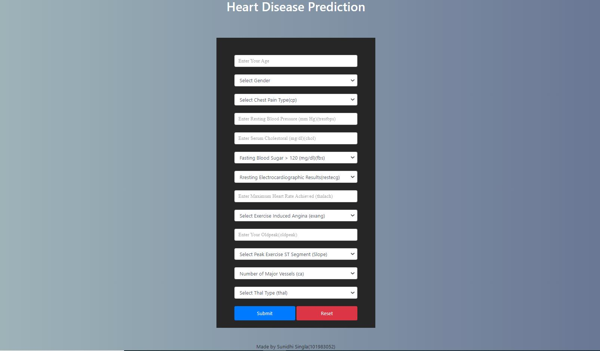
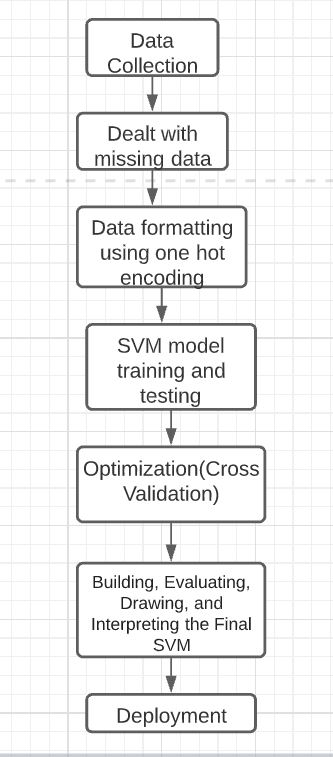

# Heart-Disease-Prediction Web Application

## A Web Application to predict Heart-Disease using SVM  

### Technology Stack used in this project
Python,Logistic Regression ,Flask, HTML, CSS, Heroku

### 1. Load Dataset
Heart-Disease-Prediction Original Data Set

Attribute Information:
1.	Sample code number: ID number
2.	Clump Thickness
3.	Uniformity of Cell size
4.	Uniformity of Cell shape
5.	Marginal Adhesion
6.	Single Epithelial Cell Size
7.	Bare Nuclei
8.	Bland Chromatin
9.	Normal Nucleoli
10.	Mitoses
11.	Class

### 2.Build and Train the model using SVM

Using SVM (Support Vector Machines) we build and train a model using human cell records, and classify cells to predict whether the samples are Effected or Not-Affected.

### 3.Flask Creation

1.	Heart-Disease-Prediction.ipynb — This contains code for the machine learning model to predict heart disease based on the class.
2.	app.py — This contains Flask APIs that receives cells details through GUI or API calls, computes the predicted value based on our model and returns it
3.	templates & static  — This folders contains the HTML template and CSS styling to allow user to enter cells details and displays the predicted output.

### 4. Adding form to flask app
 
### 5.Integrating web application with machine learning backend.

### 6. Deployment on Heroku

You can find the deployed app at https://heart-disease-prediction1234.herokuapp.com/
The output looks like :  

## Methodology

## Novelty
SVM model is used along with cross validation for optimization which gives the best accuracy.
Predict the disease before it becoming fatal.
Easy to use app.
